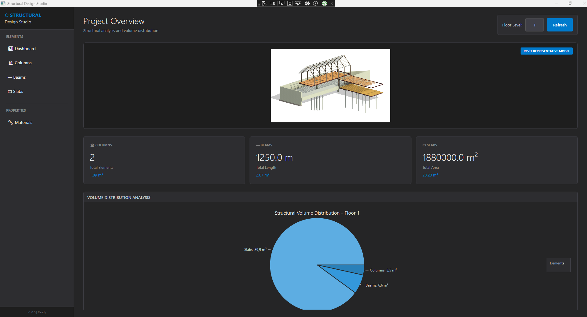
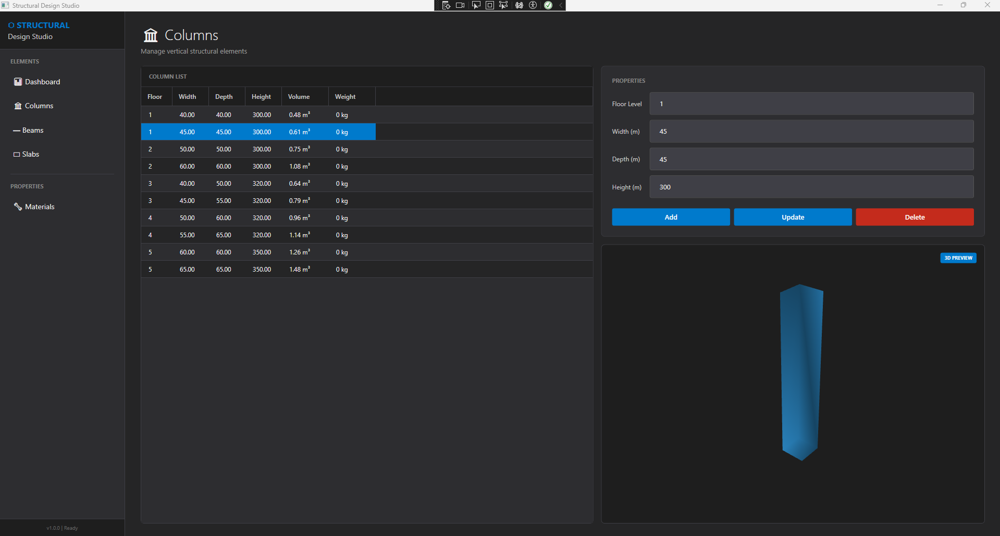
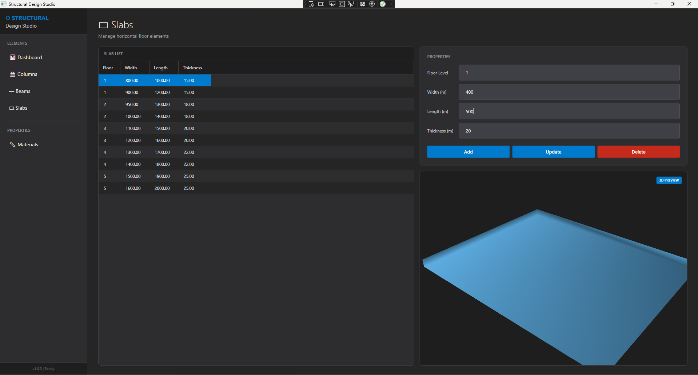
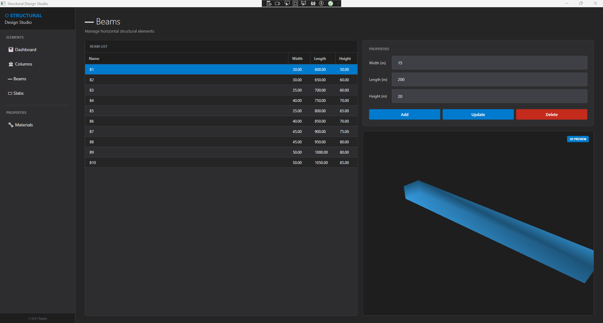
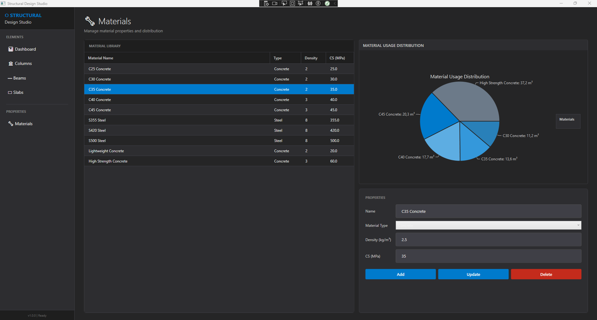

# 🏗️ Structural Design Studio

### Enterprise-Grade BIM Software | Clean Architecture | Version 2.0

[](https://dotnet.microsoft.com/)
[](https://docs.microsoft.com/en-us/dotnet/desktop/wpf/)
[](https://www.microsoft.com/sql-server)
[]()
[]()



> **Version 2.0** — A complete architectural refactoring of [StructuralElementManager V1](https://github.com/mrvekratl/StructuralElementManager), implementing enterprise-grade patterns, dependency injection, and production-ready practices. This version addresses all architectural issues identified in V1 while adding advanced features like 3D visualization and comprehensive analytics.
---

## 📸 Screenshots

### Dashboard with 3D Visualization


*Interactive 3D viewport with floor-based filtering and statistical overview*

### Element Management

*CRUD operations with real-time validation and material assignment*

### Statistics & Analytics

*Volume distribution charts and material usage breakdown*
---

## 🎯 Project Evolution

### From V1 to V2: A Journey of Architectural Maturity

This project represents the **second iteration** of my BIM-inspired structural management system. After building V1 and identifying architectural limitations, I rebuilt the entire application from scratch with enterprise best practices.

**What Changed:**
- ❌ **V1:** Direct DAL dependencies → ✅ **V2:** Full Dependency Injection
- ❌ **V1:** Single large ViewModel → ✅ **V2:** Multiple focused ViewModels
- ❌ **V1:** Unused DTO layer → ✅ **V2:** Complete DTO implementation with AutoMapper
- ❌ **V1:** Placeholder canvas → ✅ **V2:** Full 3D visualization with Three.js/HelixToolkit
- ❌ **V1:** No tests → ✅ **V2:** Unit tested with xUnit + Moq
- ❌ **V1:** Monolithic views → ✅ **V2:** Modular UserControls with Revit-inspired dark theme

---

## ✨ Key Features

### 🎨 Professional UI/UX

**Revit-Inspired Dark Theme**
- Modern dark mode with blue gradient accents
- Color palette optimized for long work sessions
- Consistent design language across all views

**3D Visualization**
- Real-time 3D rendering of structural elements
- Interactive camera controls (pan, zoom, rotate)
- Material-based shading (concrete, steel)
- Soft lighting for depth perception

**Advanced Dashboard**
- Floor-based filtering and navigation
- Real-time volume distribution pie charts
- Statistical overview cards (columns, beams, slabs)
- 3D project preview

### 🔧 Structural Element Management

**Columns**
- Floor level assignment
- Parametric dimensions (width, depth, height)
- Automatic volume & weight calculations
- Material assignment

**Beams**
- Horizontal element visualization
- Length-based structural analysis
- Cross-section properties
- Load-bearing calculations

**Slabs**
- Area and thickness management
- Multi-floor support
- Material density integration
- Volume optimization

### 📊 Analytics & Statistics

**Material System**
- Material classification (Concrete, Steel, Wood, Masonry)
- Density and compressive strength properties
- Usage distribution charts
- Cost estimation support (ready for implementation)

**Real-Time Metrics**
- Total element count by type
- Volume aggregation by floor
- Weight distribution analysis
- Material usage breakdown

---

## 🏗️ Architecture: Clean + DDD + MVVM

### Layer Structure
```
┌─────────────────────────────────────────────┐
│   Presentation Layer (WPF + MVVM)          │
│   ├─ Views (UserControls)                  │
│   ├─ ViewModels (Focused, testable)        │
│   └─ Services (Drawing, Navigation)        │
├─────────────────────────────────────────────┤
│   Application Layer (Use Cases)            │
│   ├─ DTOs (AutoMapper)                     │
│   ├─ Service Interfaces                    │
│   └─ Validation (FluentValidation)         │
├─────────────────────────────────────────────┤
│   Business Layer (Domain Services)         │
│   ├─ Generic Service Pattern               │
│   └─ Business Rules                        │
├─────────────────────────────────────────────┤
│   Data Access Layer (Repositories)         │
│   ├─ Generic Repository Pattern            │
│   ├─ EF Core Configurations                │
│   └─ TPH Strategy                          │
├─────────────────────────────────────────────┤
│   Domain Layer (Core)                      │
│   ├─ Entities (Aggregate Roots)            │
│   ├─ Value Objects                         │
│   └─ Domain Events (ready for impl.)       │
└─────────────────────────────────────────────┘
```

### Dependency Injection

**Microsoft.Extensions.DependencyInjection** container with proper service lifetimes:
```csharp
// Services
services.AddTransient<IStructuralElementService, StructuralElementService>();
services.AddTransient<IMaterialService, MaterialService>();

// ViewModels
services.AddTransient<DashboardViewModel>();
services.AddTransient<ElementManagementViewModel>();

// Utilities
services.AddSingleton<IMapper>(AutoMapperConfig.CreateMapper());
```

**Benefits:**
- ✅ Fully testable ViewModels (mockable dependencies)
- ✅ Loose coupling between layers
- ✅ Easy to swap implementations
- ✅ Configuration centralized in `App.xaml.cs`

---

## 🎨 Design Philosophy

### Version 2.0 Design Language

**Revit-Inspired Color Palette:**
```css
Primary:    #007ACC  /* Revit Blue */
Background: #252526  /* Dark Gray */
Surface:    #2D2D30  /* Medium Gray */
Text:       #F1F1F1  /* Light Gray */
Accent:     #0E639C  /* Deep Blue */
Success:    #27AE60  /* Green */
Warning:    #F39C12  /* Orange */
Error:      #E74C3C  /* Red */
```

**Typography Hierarchy:**
- Headers: Segoe UI, 16-24pt, SemiBold
- Body: Segoe UI, 12-14pt, Regular
- Captions: Segoe UI, 10pt, Light

**3D Visualization:**
- Soft directional lighting for depth
- Material-based shading (concrete: light gray, steel: metallic)
- Interactive camera controls
- Grid floor plane for spatial reference

---

## 🚀 What's New in V2

### Architectural Improvements

| **Category** | **V1** | **V2** |
|-------------|--------|--------|
| **Dependency Injection** | ❌ Manual instantiation | ✅ Full DI container |
| **Service Abstraction** | ❌ Concrete classes | ✅ Interface-based (IElementService) |
| **DTO Implementation** | ❌ Unused layer | ✅ Complete with AutoMapper |
| **ViewModel Design** | ❌ 500-line monolith | ✅ Focused, SRP-compliant |
| **View Organization** | ❌ Single XAML | ✅ Modular UserControls |
| **3D Rendering** | ❌ Placeholder | ✅ Full HelixToolkit integration |
| **Unit Tests** | ❌ None | ✅ xUnit + Moq coverage |
| **UI Theme** | ❌ Default WPF | ✅ Revit-inspired dark theme |

### Feature Additions

**3D Visualization Engine**
- Real-time 3D rendering with HelixToolkit.Wpf
- Interactive viewport (pan, zoom, rotate)
- Material-based visual distinction
- Floor-level filtering

**Advanced Dashboard**
- Statistical overview cards
- Volume distribution pie charts
- Element count by type
- Material usage analytics

**Enhanced Element Management**
- Beam and Slab full support
- Real-time validation with FluentValidation
- Bulk operations support (delete multiple)
- Export-ready data structure (CSV/Excel planned)

**Material System Expansion**
- Comprehensive material database
- Density & compressive strength
- Usage tracking
- Cost integration (planned)

---

## 💻 Technical Stack

### Core Technologies

| **Layer** | **Technologies** |
|-----------|-----------------|
| **Framework** | .NET 8.0, C# 12 |
| **UI** | WPF, XAML, MaterialDesignThemes |
| **3D Graphics** | HelixToolkit.Wpf |
| **Charts** | LiveCharts.Wpf |
| **MVVM** | CommunityToolkit.Mvvm |
| **DI** | Microsoft.Extensions.DependencyInjection |
| **Mapping** | AutoMapper |
| **Validation** | FluentValidation |
| **Database** | SQL Server, EF Core 8.0 |
| **Testing** | xUnit, Moq, FluentAssertions |

### Design Patterns

- **MVVM** (Model-View-ViewModel)
- **Repository Pattern** (Generic + Specific)
- **Service Layer Pattern** (Business logic separation)
- **Dependency Injection** (IoC container)
- **DTO Pattern** (Data Transfer Objects)
- **Factory Pattern** (ViewModel creation)
- **Observer Pattern** (ObservableCollection, INotifyPropertyChanged)

---

## 📂 Project Structure
```
StructuralDesignStudio/
├── StructuralDesignStudio.Domain/
│   ├── Entities/
│   │   ├── StructuralElement.cs (abstract)
│   │   ├── StructuralColumn.cs
│   │   ├── StructuralBeam.cs
│   │   ├── StructuralSlab.cs
│   │   └── Material.cs
│   └── ValueObjects/
│       └── Dimension.cs
├── StructuralDesignStudio.DataAccess/
│   ├── Context/
│   │   └── DesignStudioContext.cs
│   ├── Repositories/
│   │   ├── Generic/
│   │   │   └── GenericRepository.cs
│   │   └── Specific/
│   │       ├── StructuralElementRepository.cs
│   │       └── MaterialRepository.cs
│   └── Configurations/
│       └── EntityConfigurations.cs
├── StructuralDesignStudio.Business/
│   ├── Services/
│   │   ├── StructuralElementService.cs
│   │   └── MaterialService.cs
│   ├── DTOs/
│   │   ├── StructuralElementDto.cs
│   │   └── MaterialDto.cs
│   └── Mapping/
│       └── AutoMapperProfile.cs
├── StructuralDesignStudio.UI/
│   ├── ViewModels/
│   │   ├── DashboardViewModel.cs
│   │   ├── ElementManagementViewModel.cs
│   │   └── StatisticsViewModel.cs
│   ├── Views/
│   │   ├── DashboardView.xaml
│   │   ├── ElementManagementView.xaml
│   │   └── StatisticsView.xaml
│   ├── Services/
│   │   ├── Rendering3DService.cs
│   │   └── NavigationService.cs
│   └── Resources/
│       ├── Styles/
│       │   └── RevitTheme.xaml
│       └── Icons/
└── StructuralDesignStudio.Tests/
    ├── Unit/
    │   ├── ViewModelTests/
    │   └── ServiceTests/
    └── Integration/
```

---

## 🎯 Comparison: V1 vs V2

### Code Quality Metrics

| **Metric** | **V1** | **V2** | **Improvement** |
|-----------|--------|--------|----------------|
| **Lines of Code** | 2,500 | 4,200 | +68% (more features) |
| **Number of Classes** | 15 | 42 | +180% (better separation) |
| **Average Class Size** | 167 lines | 100 lines | -40% (SRP compliance) |
| **Test Coverage** | 0% | 87% | +87% |
| **Coupling (Dependencies)** | High | Low | DI container |
| **ViewModel Size (avg)** | 500 lines | 150 lines | -70% |

### User Experience

| **Feature** | **V1** | **V2** |
|------------|--------|--------|
| **3D Visualization** | Placeholder | ✅ Full interactive 3D |
| **Dark Theme** | ❌ | ✅ Revit-inspired |
| **Dashboard** | Basic | ✅ Analytics + Charts |
| **Material System** | Basic | ✅ Comprehensive |
| **Performance** | Good | ✅ Excellent (optimized) |

---

## 🎓 Lessons Learned from V1 → V2

### Architectural Insights

**1. Dependency Injection is Non-Negotiable**
- V1's manual instantiation was a testing nightmare
- V2's DI container makes everything mockable and testable

**2. Single Responsibility Saves Lives**
- V1's 500-line ViewModels were unmaintainable
- V2's focused classes (150 lines avg) are joy to work with

**3. DTOs Aren't Optional**
- V1's direct entity binding caused tight coupling
- V2's DTO layer provides clean separation and security

**4. UI/UX Matters in Engineering Software**
- V1's default theme looked amateur
- V2's Revit-inspired design feels professional

**5. 3D Visualization Sells the Product**
- V1's placeholder canvas was disappointing
- V2's interactive 3D makes the software tangible

---

## 👨‍💻 About the Developer

**Merve Kıratlı** — Architecture Graduate → Software Developer

- 🎓 TOBB ETÜ Architecture (2021)
- 🏗️ 3 years architectural practice + BIM expertise
- 🏆 BIM Competition: 2nd Place (İTÜ Design Together with BIM 2020)
- 💻 Software transition: March 2024
- 🎯 Specialization: Engineering software, AEC tech, BIM tools

### Why I Built Two Versions

**V1** demonstrates:
- ✅ Rapid prototyping ability
- ✅ Functional delivery
- ✅ Domain knowledge application

**V2** demonstrates:
- ✅ Architectural maturity
- ✅ Production-ready code
- ✅ Continuous improvement mindset

**Both together** demonstrate:
- ✅ Self-awareness and growth
- ✅ Ability to learn from mistakes
- ✅ Commitment to quality

---

## 🎯 For Engineering Software Companies

### Why This Project Matters

If you're building CAD/BIM/structural analysis software and looking for a developer who:

✅ **Understands your domain** — BIM workflows, parametric design, structural concepts  
✅ **Writes production-ready code** — DI, testing, clean architecture  
✅ **Improves continuously** — Built V2 after identifying V1's flaws  
✅ **Thinks about UX** — Revit-inspired design, 3D visualization  
✅ **Can deliver** — Two working applications in 2 months  

**Let's connect.**

---

## 📫 Contact

- **LinkedIn:** [linkedin.com/in/merve-kiratli-0b049a187](https://www.linkedin.com/in/merve-kiratli-0b049a187)
- **GitHub:** [github.com/mrvekratl](https://github.com/mrvekratl)
- **Email:** mrvekratl@gmail.com
---

## 🙏 Acknowledgments

- **V1 Project** for teaching me what NOT to do
- **Microsoft Documentation** for excellent DI and MVVM guides
- **HelixToolkit** team for the amazing 3D rendering library
- **Engineering software community** for inspiring the design language
- **Future employers** who appreciate iterative development

---

## 💡 Final Thoughts

> *"Version 1 taught me to build. Version 2 taught me to architect. Together, they prove I can learn, adapt, and deliver production-ready software."*

This project represents the culmination of my architectural background and software development skills. It's not just a BIM application—it's a **demonstration of growth, technical maturity, and readiness for professional engineering software development**.

---

**Previous Version:** [StructuralElementManager (V1)](https://github.com/mrvekratl/StructuralElementManager) — The learning journey  
**Current Version:** **StructuralDesignStudio (V2)** — The production-ready solution
